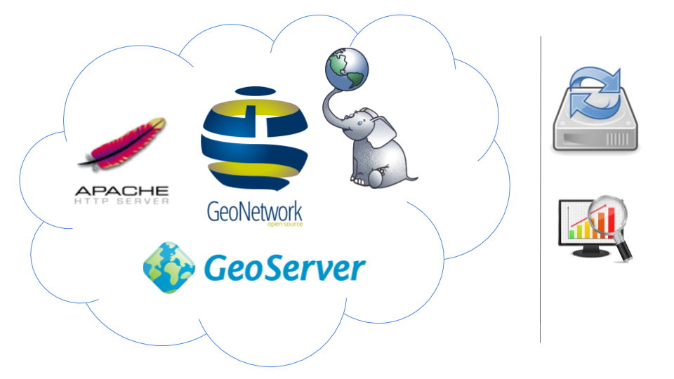
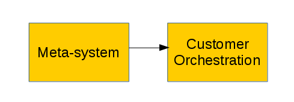
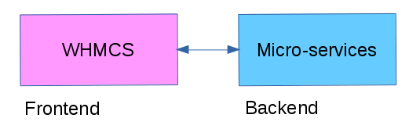
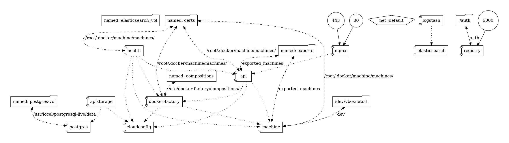
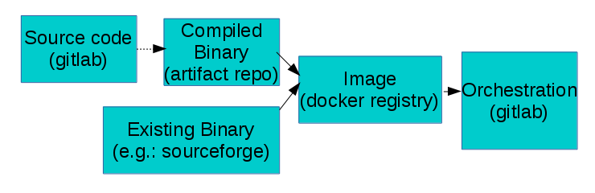

# Geocat Live
### Overview
---

## Live 2.0

+ @fa[check-circle-o] Virtualized SDI orchestrations
+ @fa[check-circle-o] Virtualized servers
+ @fa[check-circle-o] Backups, Monitoring (Third-party)
+ @fa[check-circle-o] Servers and orchestrations are managed manually

<!-- TADA -->
+++?image=assets/toast.jpg

+++
## Live 3.0

+ @fa[thumbs-up] Implementation of a meta-system, which manages SDI orchestrations

---
## Meta-system

- The backend itself, is an orchestration of virtualized (micro) services. |

<!-- --- -->
<!-- ## Meta-system -->

<!--  -->

<!-- --- -->

+++?image=assets/docker-compose.png
+++

## Software Pipeline

+ @fa[check-circle-o] Shipping containers.
+ @fa[check-circle-o] From source code to compose files.
+ @fa[check-circle-o] Semi-automated process.

---
## Live entities

+ @fa[user] Customer: information from the initial register on WHMCS.
+ @fa[cubes] Product: set of orchestrated services, defined on the config-repo on gitlab.
+ @fa[cc-visa] Order: implementation of a product for a given customer.

+++?image=assets/live_entities.png&size=auto 60%

+++
## Live Scope

@fa[check-square] The meta-system is designed to manage and related these three entities.
+++?image=assets/live_functionality.png&size=auto 90%

+++?image=assets/toast.jpg

---
## Live composition 2.0

+ Upgrade to version 3 of docker-compose
+ Use of named volumes
+ Replacement of NR by Zabbix
+ Inject EE with relevant container information
+ Externalize data dirs as build arguments
+ Multi-stage builds (experimental)

+++?image=assets/docker-compose2.png

+++?image=assets/ahead.jpg

+++
## Lessons Learned
- More decoupling between functionality and design/implementation |
- Stick to the roles |
- Don't automate everything (yet) |
- More consistent effort on Live |

+++
## Next Steps
- Polishing |
- Marketing & Sales |
- Marketing & Sales |
- Marketing & Sales |

+++
## Next Steps (technical)
- <i class="fa fa-spinner fa-pulse  fa-fw"></i> Backups
- <i class="fa fa-spinner fa-pulse  fa-fw"></i> Service logging
- <i class="fa fa-spinner fa-pulse  fa-fw"></i> Reporting
- <i class="fa fa-spinner fa-pulse  fa-fw"></i> Testing environment, end-to-end tests
- WHMCS UI
- DNS managing (manual)
- Support to extra Modules
- Load balancing and failover
- Bridge

---
## Spent Hours and Budget
- Hours: 2991
- Revenue: 4000

---
## Next Year ?
- How much budget do we want to allocate?
- Which activities do we want to prioritize (e.g.: fronted, marketing & sales, bridge)?
- Do people want to move to/from Live?
